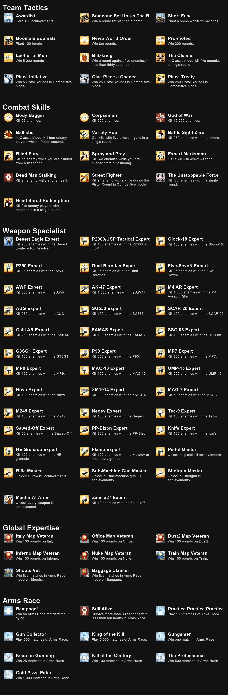

# CS2 Achievements

A simple C# program, which takes advantage of Counter Strike's **Game State Integration** (GSI) system to track data for achievements!

Made possible thanks to https://github.com/antonpup/CounterStrike2GSI

  
  

## About Game State Integration
~ (From https://github.com/antonpup/CounterStrike2GSI)
>Game State Integration is Valve's implementation for exposing current game state (such as player health, mana, ammo, etc.) and game events without the need to read game memory or risking anti-cheat detection. The information exposed by GSI is limited to what Valve has determined to expose. For example, the game can expose information about all players in the game while spectating a match, but will only expose local player's information when playing a game. While the information is limited, there is enough information to create a live game analysis tool, create custom RGB lighting effects, or create a live streaming plugin to show additional game information. For example, GSI can be seen used during competitive tournament live streams to show currently spectated player's information and in-game statistics.

## Installation
You can find the latest release here: https://github.com/callumok2004/CS2Achievements/releases/latest 
Download and run the latest version, and you should be good to go, you may need to restart Counter Strike if it was already running so GSI gets hooked up. 
If you receive any errors, you may need to run the program as an administrator so the necessary configuration files can be created, this should only be needed once!

## Notes
Most available achievements are related to kills with weapons, or winning rounds/matches on certain maps.
GSI does not give the local player enough information to be able to get a lot of others working, such as enemy weapons, damage inflicted etc

## Achievements
